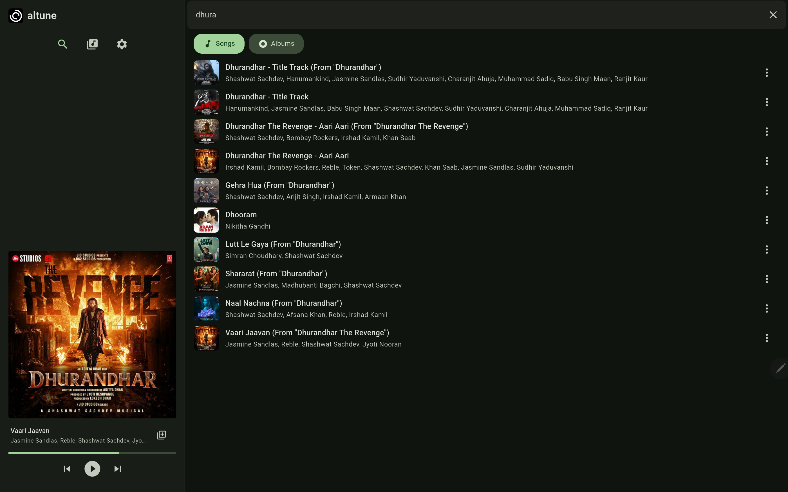
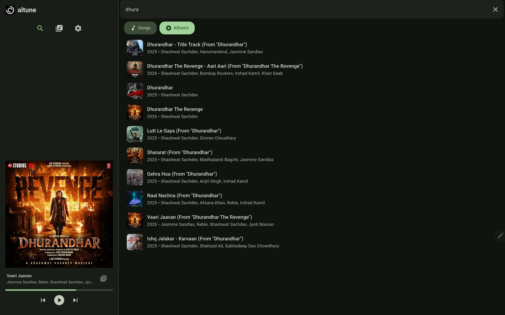
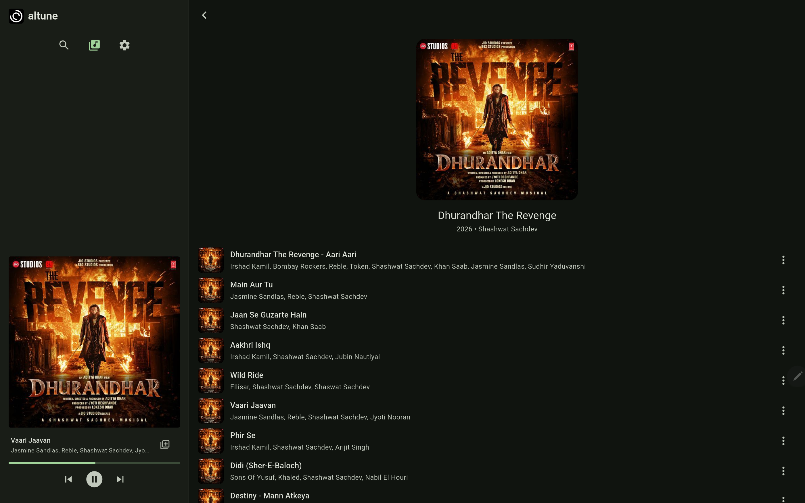
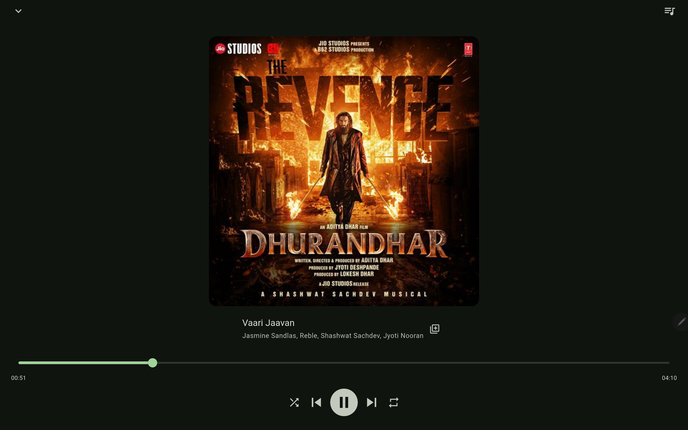

<p align="center">
  
</p>

<h1 align="center">altune</h1>

<p align="center">
  A music player for Android and Linux that respects you. No account needed.
  No ads. No tracking. Just search, stream, and save on any device — phone,
  tablet, TV, or desktop.
</p>

<p align="center">
  
  
  
</p>

## Features

- **Search millions of songs and albums**
- **Tap to play** — instant streaming, no accounts, no ads
- **Save songs** to your library — add to any playlist, available instantly
- **Build playlists** with proper queue management — shuffle, repeat, reorder
- **Backup & restore** your library — export/import JSON backups of songs and playlists
- **Queue controls** — play next, add to end, reorder, remove
- **Works across phone, tablet, TV, and desktop** — adaptive layout with sidebar on large screens, mini player on small screens
- **Full D-pad navigation** on TV — no touch required
- **Runs on Linux** alongside Android
- **Background playback** — keep the music going while you use other apps

No sign-ups, no trackers, no clutter. Just music.

## Screenshots

<div align="center">
  <figure>
    
    
    <figcaption>Search songs and albums from your phone, tablet, or TV.</figcaption>
  </figure>
  <br>
  <figure>
    
    
    <figcaption>Browse albums and play with the full-screen player.</figcaption>
  </figure>
</div>

## Installation

### Android

Download the latest release APK from the [Releases page](https://github.com/altune-music/app/releases) and install it on your device.

### Linux

```bash
flutter build linux --release
```

## Development

```bash
flutter pub get
flutter test
```

See [`AGENTS.md`](AGENTS.md) for the project's workflow, conventions, and AI-assisted development rules. Internal behavior specs live in [`docs/specs/`](docs/specs).

## Contributing

Pull requests and bug reports are welcome. Please read [`CONTRIBUTING.md`](CONTRIBUTING.md) first.

## Disclaimer

This app is an independent, third-party client. See [`disclaimer.md`](disclaimer.md) for details.

## License

[GPL-3.0](LICENSE)

